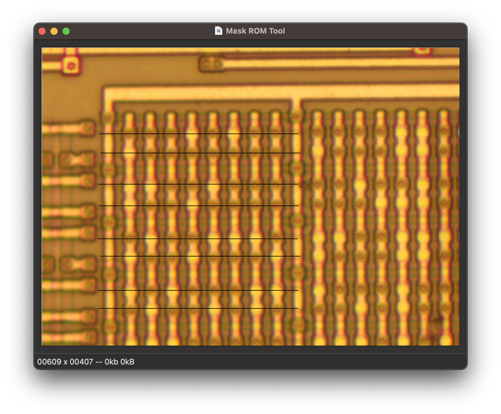
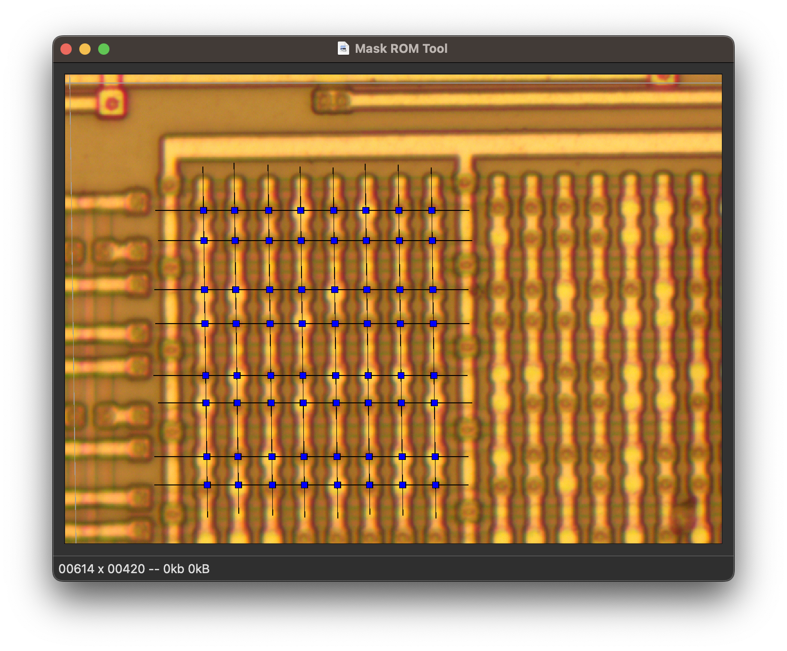
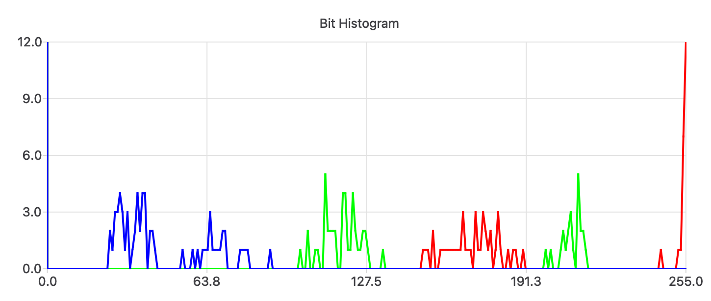
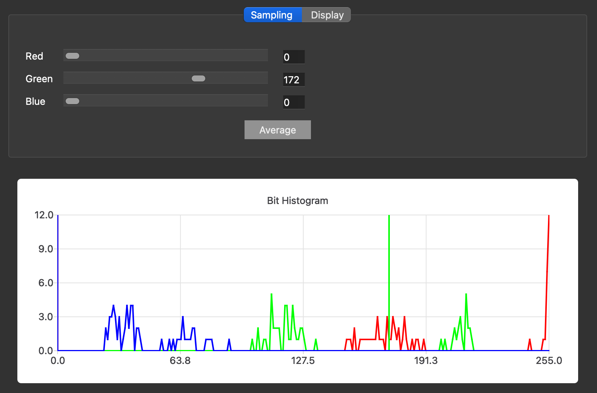
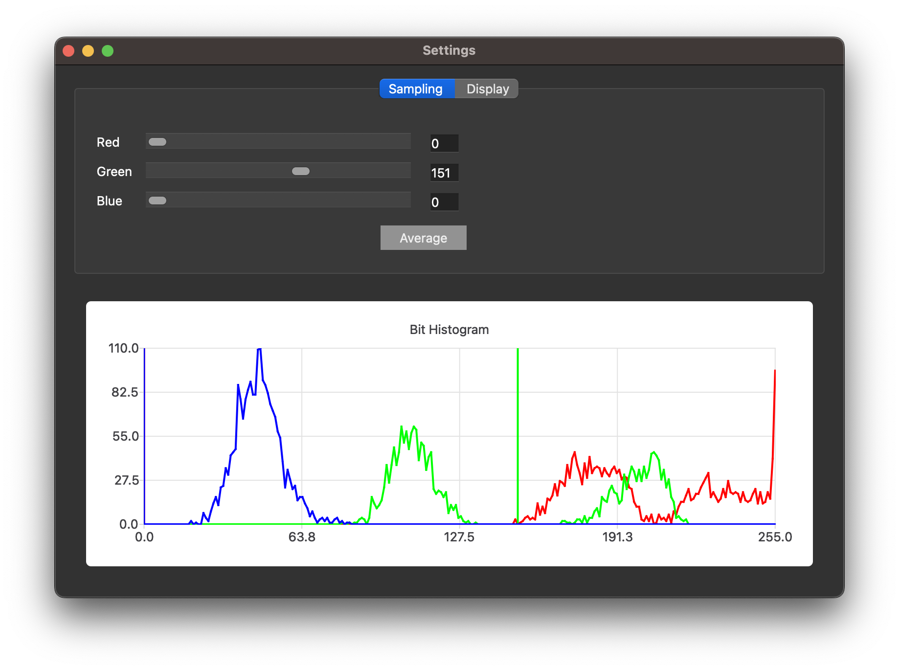
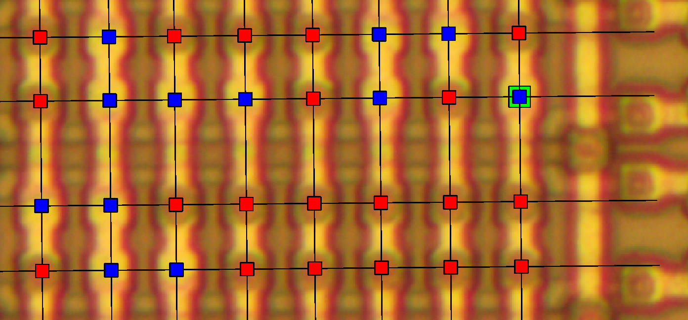

# GameBoy ROM Tutorial

Howdy y'all,

This is a quick little tutorial on mask ROM recovery, in which we'll
begin with photographs of the mask ROM from Nintendo's GameBoy and end
up with a ROM file that can be disassembled or emulated.

The GameBoy is a good target for this because it uses what's called a
Via ROM, meaning that metal Vias between layers encode the individual
bits and those bits can be read from the surface of the chip.  The ROM
is also small enough that I can include it in a Github repository and
that you won't spend weeks working out minor bit errors.

Cheers from Knoxville,

--Travis Goodspeed

## Photography

We'll begin with `dmg01cpurom.bmp`, which I photographed in my home
lab after decapsulating a chip in HNO3 and cleaning it in an
ultrasonic bath of acetone.  This chip does not require delayering
with hydrofluoric acid or bit staining with a Dash Etch solution of
HNO3, HF, and acetic acid.

The photo was produced in my metallurgical microscope as twenty-two
frames under 50x magnification, which were then stitched together in
Hugin.  A biological microscope will not work, because the silicon
substrate is opaqe to visible light; in a metallurgical microscope,
the light reflects off of the sample rather than transmitting through
it.

My original photo was too large for Github, so the version that you
will work with is reduced in resolution.  Lossy compression is
avoided because it can confuse the image recognition.

If you produce your own photo of the DMG-01-CPU chip, the instructions
here will work just as well.

## Bit Extraction

In this tutorial, we'll be extracting the bits with
[MaskRomTool](https://github.com/travisgoodspeed/maskromtool/), a CAD
program of mine for rapid bit extraction.

Begin by compiling MaskRomTool and installing it.  If you are
comfortable with the unix command-line, you will want the executable
`maskromtool` to be in your `$PATH`.  If not, don't worry about that
part, as all the features are also available from the GUI.

After you have it running, use MaskRomTool to open `dmg01cpurom.bmp`.

~[First Opening of the Image](screenshots/10-firstopen.png)

Notice how a grey crosshair follows your mouse.  This begins straight,
but it will tilt to match the row and column lines that you place on
the ROM, allowing you to see from one side of your monitor which bits
will be covered by the other side of your monitor.

Notice also that the bits in the ROM come in pairs of regular rows and
groups of eight regular columns.  In MaskRomTool, you'll be placing
rows and columns, but there are no strict limits about matching the
grouping of the original image.  If you find that you can reliably
place a massive row that crosses the entire width of the image, or a
massive column that crosses the entire height of the image, feel free
to do so.

### Navigation

### Placing Rows

We'll begin with a few short rows and try long ones later.  First,
click a little to the left of the leftmost bit, and then move your
mouse to the right but do **NOT** click.  Instead press the `R` key to
place a Row.  A thin black line will appear between those two points.

You could repeat this to place all of the rows, but that would be
labor intensive and might involve a lot of scrolling for very long
ones.  Instead, keep your mouse on the right side but move it down a
little.  When your crosshair lines up with the row, press `Shift+R` or
the spacebar to drop another row.

Repeating this across many rows should mark them out in short order.
In the following screenshot, I've marked short segments of the first
eight rows.

Once you get the hang of marking repeated rows from only their
right-hand side, you might as well mark them across the entire image
to save time and effort.  If straight lines can't cross the entire
image, then mark shorter lengths or better align your panorama of
photographs.



### Placing Columns

While you've marked some columns, the software still doesn't know
where your bits are because you haven't marked any bits.

To mark you first column, first click above the bit in your first
column.  Then, as with a row, move your mouse beneath the last bit of
the column and hit `Shift+C` to place a column line.  (Do **NOT** click
a second time.)

Repeat this by moving your mouse beneath the other last bits and
pressing `Shift+C`.  As each column line is dropped across the row
lines, blue squares will appear over each bit.  The software now knows
where the bits are, and in the next step we'll teach it to know the
difference between a one and a zero.



### Recognizing Bits

To identify bits, the software needs not just the bit positions that
you've provided, but also a threshold and color channel to distinguish
the bits.  Click Edit and then Choose Bit Threshold to see the
following graph and choose your own threshold.



This histogram of the first 64 bits shows gaps in all three color
channels.  The largest gap is in the Green channel, so I would set the
threshold to 172 in that channel.  Notice how the bit boxes
automatically adjust themselves as you change the threshold.

Although the Blue and Red channels could work for this image, we want
the Green channel because it has the *largest* gap.  When we start
adding up all of the bits in the image, the larger color distances
will ensure that we get fewer bit errors.



Once you've set the first sixty-four bits, click View and ASCII
Preview to see them.  Ain't that nifty?

```
11101011
01111111
00110111
01101111
10110001
01101110
01011100
10110101
```

### More Bits

Now that you've got a taste of recognizing sixty four bits, let's
recognize all of them.

First, wipe our your previous work by either deleting
`dmg01cpurom.bmp.json` and opening `dmg01cpurom.bmp` in a fresh
instance of Mask ROM Tool or bulk erase your lines.  Bulk erasure is
done by drag-selecting lines and then pressing `Shift+D` to cut them
out.

(Strictly speaking, you could also mark the image with many very small
rows and columns.  The only reason I recommend against that is that
it takes forever, not that it doesn't work.)

After erasing the lines, drop a row that goes from the far left of the
screen to the far right.  If you are starting over instead of deleting
prior work, it sometimes helps to first draw a shorter row so that the
angle of the cross-hairs will be tilted the same as the image.  You
can draw an attempt at a row with `R` and then delete it with `D`,
without the software forgetting about your first starting position.

After getting the first line drawn, move your mouse down the right
side of the rom image, hitting `Shift+R` or the space bar whenever you
pass a row to drop a line.  If you find that you marked the bit just a
little off, you can use the `S` key to Set the position of the last
line, moving it to the new mouse location.

After drawing the long rows, draw the columns.  Just click once above
the first bit to set a start point, then hit `C` beneath the last bit
to draw a column.  `Shift+C` will drop a new column of the same angle
at another end point, so you can step through the image and draw all
of the columns in short order.


When all the bits have been set, use Edit / Choose Bit Threshold to
adjust the threshold a bit.  Notice how the curve is a lot smoother
with so many more bits, and that 151 might be a better choice than
172.



### Finding and Fixing Mistakes

It's a great feeling to have all the bits marked, but that's rarely
the end of it.  Before continuing on to decoding the ROM, it's a good
idea to do some quick sanity checks and make sure that no mistakes
were made.

The `V` key or DRC / Evaluate Rules rune some quick sanity checks over
your design.  For example, what if you placed a line wrong and the
color of a bit was suspiciously close to the threshold?  You might get
a DRC error like this one, which you could resolve by correcting the
line placement.  Each Design Rule Check (DRC) violation has a position
and appears as a yellow box in the GUI.


While mistakes like a misplaced line are your fault, those mistakes
which are not your fault must also be corrected.  Sometimes a bit of
dust sneaks into the photograph, obscuring a bit's value at the sample
location.  Sometimes a chemistry error makes the bit a little hard to
see.

In situations like this, where you know better than the machine, press
`Shift+F` with your mouse over the bit to Force its value and place a
little green box around the bit.  If the wrong value is applied,
pressing `Shift+F` again will flip it.



After all of this, the bits are finally complete!

```
11101011111100101100101100110010011000110111110000100001011100101110000000110011110001001001001011000100001011110001101100001000
01111111011100110111111101100011001010110100111100000110101010110011001111110011001010111011000000111000001011101101011011101111
00110111110110110111011111010111011001101001011101111111110110100111000101110010010110000101011101110001111101110111101111011000
01101111111000111110111011110110001011100101011010100010001110000111100000111010011111000111001100101111010000110100111111101001
10110001001100001011100110110111000110011101100111100000111100111111011010110001111111100111011010111010000110100100001100010011
01101110011100110110100100110111011100110101101001001111111100110010111110100011001110011010011101111010000111100111001010110010
01011100011101111111110001110111101100000101101100111000011100010011000011110101001100001011111000110000100110010111011111010010
10110101110101111011101001011111001110101111101000010101111100011101011111000011111010111010101100001110011110011011011111000101
00011111000101000001101110011110101111001111000011111011011100000100011011010000110100111001100100110011110101000101101110110110
11011001000101100111100100011011001110010101010100001101111101110110010110000111010101101101111010101100101100101101111110010111
11111111111110011111101101010101001101111101000010100110101010011011010011111001101101001101010110101010010101011110010110100011
01011110111110100001111011010110001000011101000000111011001011100101001111101110100110110000101000101011100001000001111000100001
11011000100010111011110010010101001011000111000010011000111110001111011011000000100111001101010010001100111101100010100110111001
11111011001010011111101000111101001100101111100110110101011111011011110110000101001011001101000100110111001101011110110110001010
00111111111101100011101111110010001011001111010000011111101111010011011111110111001101110111010101011111111110110101011100111111
10101101111101111000110111110110100001010111100111001101101110100100111111000011011110101010001101011100100011111100111110011111
```

## About the CLI

So far, we've been using this tool in the GUI, but when you get to
larger projects you'll want to automate some things with the GUI.  By
default it launches the GUI, so you'll want to add `-platform
offscreen -e` when running it standalone, to both avoid opening
windows and to exit on completion.

```
Usage: maskromtool [options] image json
Mask ROM Tool

Options:
  -h, --help                 Displays help on commandline options.
  --help-all                 Displays help including Qt specific options.
  -v, --version              Displays version information.
  -e, --exit                 Exit after processing arguments.
  --opengl                   Enable OpenGL.  (Not yet stable.)
  -d, --drc                  Run default Design Rule Checks.
  -D, --DRC                  Run all Design Rule Checks.
  --diff-ascii <file>        Compares against ASCII art, for finding errors.
  -a, --export-ascii <file>  Export ASCII bits for use in ZorRom.
  --export-csv <file>        Export CSV bits for use in Matlab or Excel.
  --export-json <file>       Export JSON bit positions.
  --export-python <file>     Export Python arrays.
  --export-marc4 <file>      Export MARC4 ROM banks, left to right.
  --export-arm6 <file>       Export ARM6L (MYK82) ROM.
  --export-photo <file>      Export a photograph.

Arguments:
  image                      ROM photograph to open.
  json                       JSON lines to open.
```


## Decoding a ROM File

Now that your project is marked up and the bits look accurate, you'll
need to pass the bitfile along to other tools for decoding.  The best
of these is [Zorrom](https://github.com/JohnDMcMaster/zorrom), a
collection of Python scripts by John McMaster.

### Decoding with Zorrom

First we need an ASCII file of the ROM bits.  You can generate this
with File / Export / ASCII in MaskRomTool's GUI or from the CLI with
`maskromtool -platform offscreen dmg01cpurom.bmp -a DMG_ROM.txt -e`.

Then just like in the Zorrom documentation, we can ask Zorrom to
present us with all decodings of the bits that provide 0x31 as the
first byte.  (0x31 is GameBoy's opcode to set the call stack value,
and it's a reasonable guess as to the first instruction of the ROM.)

```
air% ./solver.py --bytes 0x31 DMG_ROM.txt DMG_ROM
Loaded 128x x 16 h => 2048 bits (256 words)
66 match True, score 1.000
  r-180_flipx-1_invert-1_cols-left
69 match True, score 1.000
  r-180_flipx-1_invert-1_cols-downr
Tries: 80
Best score: 1.000, r-180_flipx-1_invert-1_cols-left
Keep matches: 2
  Writing DMG_ROM/r-180_flipx-1_invert-1_cols-left.bin
  Writing DMG_ROM/r-180_flipx-1_invert-1_cols-downr.bin
air% 
```

Having two potential values, we can disassemble each to find the right
one.  Sure enough, `r-180_flipx-1_invert-1_cols-downr.bin` contains
the right bytes because it loads 0xFFFE into the stack pointer.

```
air% r2 -a gb r-180_flipx-1_invert-1_cols-downr.bin
[0x00000000]> pd 1
            0x00000000      31feff         ld sp, 0xfffe
^D
air% r2 -a gb r-180_flipx-1_invert-1_cols-left.bin 
[0x00000000]> pd 1
            0x00000000      311147         ld sp, 0x4711
^D
air% 
```


