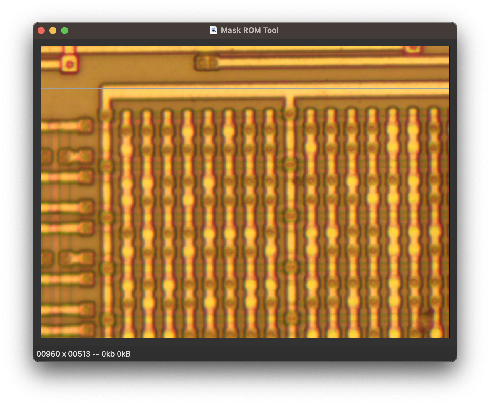
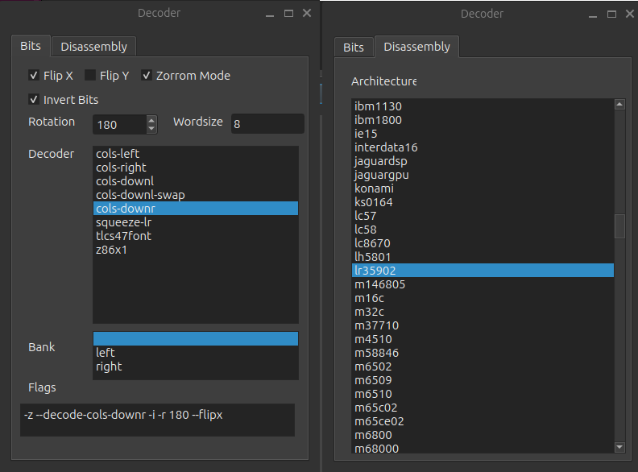
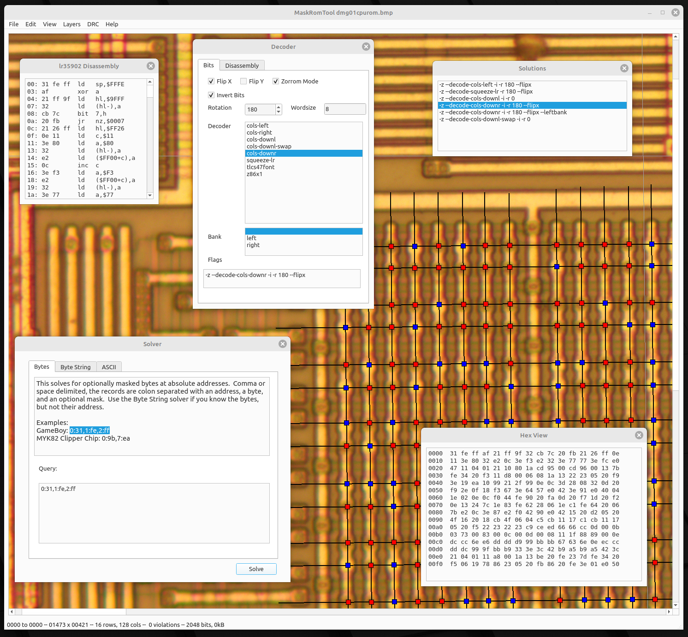
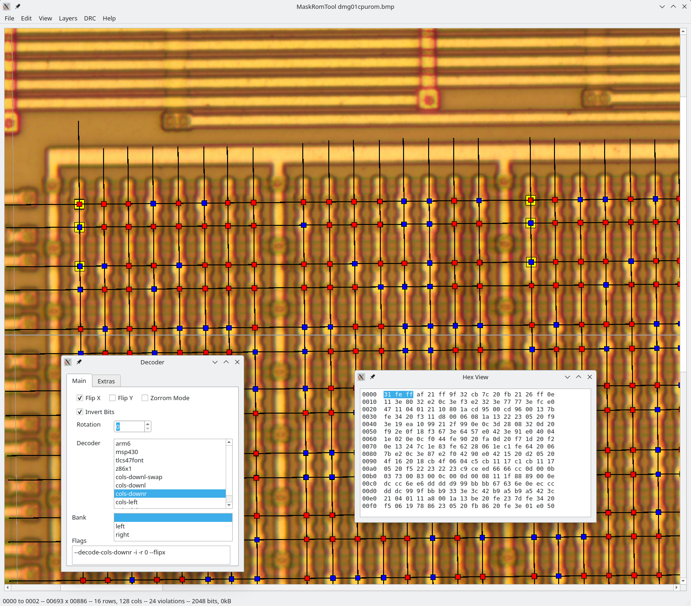

# GameBoy ROM Tutorial

Howdy y'all,

This is a quick little tutorial on mask ROM recovery, in which we'll
begin with photographs of the mask ROM from Nintendo's GameBoy and end
up with a ROM file that can be disassembled or emulated.

The GameBoy is a good target for this because it uses what's called a
Via ROM, meaning that metal Vias between layers encode the individual
bits and those bits can be read from the surface of the chip.  The ROM
is also small enough that I can include it in a Github repository and
that you won't spend weeks working out minor bit errors.

Cheers from Knoxville,

--Travis Goodspeed

## Photography

We'll begin with `dmg01cpurom.bmp`, which I photographed in my home
lab after decapsulating a chip in HNO3 and cleaning it in an
ultrasonic bath of acetone.  This chip does not require delayering
with hydrofluoric acid or bit staining with a Dash Etch solution of
HNO3, HF, and acetic acid.

The photo was produced in my metallurgical microscope as twenty-two
frames under 50x magnification, which were then stitched together in
Hugin.  A biological microscope will not work, because the silicon
substrate is opaqe to visible light; in a metallurgical microscope,
the light reflects off of the sample rather than transmitting through
it.

My original photo was too large for Github, so the version that you
will work with is reduced in resolution.  Lossy compression is avoided
because it can confuse the image recognition.

If you produce your own photo of the DMG-01-CPU chip, the instructions
here will work just as well.

## Bit Extraction

In this tutorial, we'll be extracting the bits with
[MaskRomTool](https://github.com/travisgoodspeed/maskromtool/), a CAD
program of mine for rapid bit extraction.

Begin by compiling MaskRomTool and installing it.  If you are
comfortable with the unix command-line, you will want the executables
`maskromtool` and `gatorom` to be in your `$PATH`.  If not, don't
worry about that part, as all the features are also available from the
GUI.

On Windows and macOS, you can avoid compiling the code by using a
[prebuilt
release](https://github.com/travisgoodspeed/maskromtool/releases).
These are compiled every few months when the code feels particularly
stable.

After you have it running, use MaskRomTool to open `dmg01cpurom.bmp`.



Notice how a grey crosshair follows your mouse.  They begin straight,
but will soon tilt to match the row and column lines that you place on
the ROM.  This allows you to predict where repeated rows and columns of the same
angle will fall, as most images are tilted but most bits are in
perfect lines.

Notice also that the bits in the ROM come in pairs of regular rows and
groups of eight regular columns.  In MaskRomTool, you'll be placing
rows and columns, but there are no strict limits about matching the
grouping of the original image.  If you find that you can reliably
place a massive row that crosses the entire width of the image, or a
massive column that crosses the entire height of the image, feel free
to do so.  If the image is crooked and you need a very short line to
work around an error, that's also fine.

### Navigation

To move around the image, you will use either your mouse or your
laptop's trackpad.  Mice are preferred because right clicking is a
little easier.

Drag the background with the middle mouse button to scroll a little
bit, or use two fingers on the trackpad to pan around the screen.  If
you hold the shift key, this panning will be much faster.

Zoom is very important for these projects.  The `QAZ` keys handle
zooming, with `Q` snapping to native resolution, `A` and `Z` zooming
in and out.  On a mouse, holding `ctrl` and spinning the scroll wheel
will also adjust the zoom.  With a trackpad, you might pinch to zoom,
but only if your operating system supports it.

Spend a moment moving around the ROM photograph, guessing at what
different structures are.  After that, we'll start marking up the
image.

### Placing Rows

We'll begin with a few short rows and try long ones later.  First,
click a little to the left of the leftmost bit, and then move your
mouse to the right but do **NOT** click.  Instead press the `R` key to
place a Row.  A thin black line will appear between those two points.

You could repeat this to place all of the rows, but that would be
labor intensive and might involve a lot of scrolling for very long
ones.  Instead, keep your mouse on the right side but move it down a
little.  When your crosshair lines up with the row, press the spacebar
to drop another row with the same length and angle.

Repeating this across many rows should mark them out in short order.
In the following screenshot, I've marked short segments of the first
eight rows.

Once you get the hang of marking repeated rows from only their
right-hand side, you might as well mark them across the entire image
to save time and effort.  If straight lines can't cross the entire
image, then mark shorter lengths or better align your panorama of
photographs.

If you place a row in the wrong position, there are ways to move it.
First drag a box with the left mouse button to select one or more
lines, then drag with the right mouse button to move them.  The arrow
keys will also move a selection, and the `S` key will set the position
of a single line to a new end point.


### Placing Columns

While you've marked some rows, the software still doesn't know
where your bits are because you haven't yet marked any columns.

To mark you first column, first click above the bit in your first
column.  Then, as with a row, move your mouse beneath the last bit of
the column and hit `C` to place a column line.  (Do **NOT** click
a second time.)

Repeat this by moving your mouse beneath the other last bits and
pressing the spacebar.  As each column line is dropped across the row
lines, blue squares will appear over each bit.  The software now knows
where the bits are, and in the next step we'll teach it to know the
difference between a one and a zero.

Please double-check that bits are in reasonable positions.  If any of
the bit boxes are not directly over the bit, select the offending row
or column and drag with the right mouse button to correct its
position.  If the angle is wrong, use `D` to erase the line and then
draw a fresh one.


### Recognizing Bits

To identify bits, the software needs not just the bit positions that
you've provided, but also a threshold and color channel to distinguish
the bits.  Click Edit and then Choose Bit Threshold to see the
following graph and choose your own threshold.


This histogram of the first 64 bits shows gaps in all three color
channels.  The largest gap is in the Green channel, so I would set the
threshold to 172 in that channel.  Notice how the bit boxes
automatically adjust themselves as you change the threshold.

Although the Blue and Red channels could work for this image, we want
the Green channel because it has the *largest* gap.  When we start
adding up all of the bits in the image, the larger color distances
will ensure that we get fewer bit errors.


Once you've set the first sixty-four bits, click View and ASCII
Preview to see them.  Ain't that nifty?

```
11101011
01111111
00110111
01101111
10110001
01101110
01011100
10110101
```

### More Bits

Now that you've got a taste of recognizing sixty four bits, let's
recognize all of them.

First, wipe our your previous work by either deleting
`dmg01cpurom.bmp.json` and opening `dmg01cpurom.bmp` in a fresh
instance of Mask ROM Tool or bulk erase your lines.  Bulk erasure is
performed by drag-selecting lines and then pressing `D` to cut them
out.

(Strictly speaking, you could also mark the image with many very small
rows and columns.  The only reason I recommend against that is that
it takes forever.)

After erasing the lines, drop a row that goes from the far left of the
screen to the far right.  If you are starting over instead of deleting
prior work, it sometimes helps to first draw a shorter row so that the
angle of the cross-hairs will be tilted the same as the image.  You
can draw an attempt at a row with `R` and then delete it with `D`,
without the software forgetting about your first starting position.

After getting the first line drawn, move your mouse down the right
side of the photograph, hitting the space bar whenever you
pass a row to drop a line.  If you find that you marked the bit just a
little off, you can use the `S` key to Set the position of the last
line, moving it to the new mouse location.  Arrow keys and dragging
with a right click will also reposition it, with bit values changing
along with the positions.

If the rows are particularly regular, you might place several at time.
To do this, select some with the left mouse button and then press
`Shift+D` to duplicate the collection.  The lines can then be moved to
the new position with the right click drag, while a duplicate copy
will remain at the original position.

After drawing the long rows, draw the columns.  Just click once above
the first bit to set a start point, then hit `C` beneath the last bit
to draw a column.  The spacebar will drop a new column of the same angle
at another end point, so you can step through the image and draw all
of the columns in short order.


When all the bits have been set, use Edit / Choose Bit Threshold to
adjust the threshold a bit.  Notice how the curve is a lot smoother
with so many more bits, and that 151 might be a better choice than
172.


### Finding and Fixing Mistakes

It's a great feeling to have all the bits marked, but that's rarely
the end of it.  Before continuing on to decoding the ROM, it's a good
idea to do some quick sanity checks and make sure that no mistakes
were made.

The `V` key or DRC / Evaluate Rules to run some quick sanity checks
over your design.  For example, what if you placed a line wrong and
the color of a bit was suspiciously close to the threshold?  You might
get a DRC error like this one, which you could resolve by correcting
the line placement.  Each Design Rule Check (DRC) violation has a
position and appears as a yellow box in the GUI.  The `E` key will
jump to the next error position in the list.


While mistakes like a misplaced line are your fault, those mistakes
which are not your fault must also be corrected.  Sometimes a bit of
dust sneaks into the photograph, obscuring a bit's value at the sample
location.  Sometimes a chemistry error makes the bit a little hard to
see.

In situations like this, where you know better than the machine, press
`Shift+F` with your mouse over the bit to Force its value and place a
little green box around the bit.  If the wrong value is applied,
pressing `Shift+F` again will flip it.


After all of this, the bits are finally complete!

```
11101011111100101100101100110010011000110111110000100001011100101110000000110011110001001001001011000100001011110001101100001000
01111111011100110111111101100011001010110100111100000110101010110011001111110011001010111011000000111000001011101101011011101111
00110111110110110111011111010111011001101001011101111111110110100111000101110010010110000101011101110001111101110111101111011000
01101111111000111110111011110110001011100101011010100010001110000111100000111010011111000111001100101111010000110100111111101001
10110001001100001011100110110111000110011101100111100000111100111111011010110001111111100111011010111010000110100100001100010011
01101110011100110110100100110111011100110101101001001111111100110010111110100011001110011010011101111010000111100111001010110010
01011100011101111111110001110111101100000101101100111000011100010011000011110101001100001011111000110000100110010111011111010010
10110101110101111011101001011111001110101111101000010101111100011101011111000011111010111010101100001110011110011011011111000101
00011111000101000001101110011110101111001111000011111011011100000100011011010000110100111001100100110011110101000101101110110110
11011001000101100111100100011011001110010101010100001101111101110110010110000111010101101101111010101100101100101101111110010111
11111111111110011111101101010101001101111101000010100110101010011011010011111001101101001101010110101010010101011110010110100011
01011110111110100001111011010110001000011101000000111011001011100101001111101110100110110000101000101011100001000001111000100001
11011000100010111011110010010101001011000111000010011000111110001111011011000000100111001101010010001100111101100010100110111001
11111011001010011111101000111101001100101111100110110101011111011011110110000101001011001101000100110111001101011110110110001010
00111111111101100011101111110010001011001111010000011111101111010011011111110111001101110111010101011111111110110101011100111111
10101101111101111000110111110110100001010111100111001101101110100100111111000011011110101010001101011100100011111100111110011111
```

## About the CLI

So far, we've been using this tool in the GUI, but when you get to
larger projects you'll want to automate some things with the CLI.  By
default it launches the GUI, so you'll want to add `-platform
offscreen -e` when running it standalone, to both avoid opening
windows and to exit on completion.

```
Usage: maskromtool [options] image json
Mask ROM Tool

Options:
  -h, --help                 Displays help on commandline options.
  --help-all                 Displays help including Qt specific options.
  -v, --version              Displays version information.
  -V, --verbose              Print verbose debugging messages.
  --stress                   Stress test bit marking.
  -e, --exit                 Exit after processing arguments.
  --disable-opengl           Disable OpenGL.
  --enable-opengl            Enable OpenGL.
  -d, --drc                  Run default Design Rule Checks.
  -D, --DRC                  Run all Design Rule Checks.
  --sampler <Default>        Bit Sampling Algorithm.
  --diff-ascii <file>        Compares against ASCII art, for finding errors.
  -a, --export-ascii <file>  Export ASCII bits.
  -o, --export <file>        Export ROM bytes.
  --export-histogram <file>  Export histogram.
  --export-csv <file>        Export CSV bits for use in Matlab or Excel.
  --export-json <file>       Export JSON bit positions.
  --export-python <file>     Export Python arrays.
  --export-photo <file>      Export a photograph.

Arguments:
  image                      ROM photograph to open.
  json                       JSON lines to open.
```

Supposing that we have the ROM as `dmg01cpurom.bmp` and its matching
`.json` file, we can export the bits from the CLI like this in macOS
or Linux.  In Windows, we call `maskromtoolcli.exe` instead of
`maskromtool` so that the console connection is maintained.

```
dell% maskromtool -platform offscreen -e dmg01cpurom.bmp -a DMG_ROM.txt
Allocation limit was  128 MB
Disabling allocation limit.
Loaded background image of  9000 , 2249
Done loading, now marking bits.
Exporting to ASCII.
dell% 
```


## Decoding a ROM File

You now have the bits of your project in physical order, but this is
quite different from the logically ordered bytes that a disassembler
or emulator would prefer.  We'll first do this graphically, and then
also see how to do it from the Unix command line.

Before we begin, please install
[MAME](https://github.com/mamedev/mame/releases) and make sure that
its disassembler, `unidasm`, is within the PATH.  If you fail to do
this, the solver will still work, but you'll miss out on seeing the
disassembled code.

### Decoding Graphically

You can play around with decoding settings manually with
Edit/Decoding.  Begin by setting the disassembly architecture to
`LR35902` and the wordsize to `8`.  The flips, rotation, and banking
will be solved for you in a bit, and the list of Flags at the bottom
shows you the options that would be passed to
[GatoROM](https://github.com/travisgoodspeed/maskromtool/blob/master/GATOREADME.md)
for decoding on the command line.



You can solve for particular byte sequences or Yara rules with
View/Solver.  Double-clicking a solution will reconfigure the decoder
and update the hex and disassembly views, so that they can be quickly
searched.

Begin by using the Bytes tap of the Solver to solve for
`0:31,1:fe,2:ff`, which means that the first three bytes will be `31
fe ff`.  This is the LR35902 machine code for setting the stack
pointer to `0xfffe`.  Double clicking on the solution `-z
--decode-cols-downr -i -r 180 --flipx` will apply those settings to
the decoder.



View/HexPreview will show the decoding live in hexadecimal.  After
selecting some bytes, you can also highlight them with
View/HighlightHexSelection to see where those bits are located in your
project file.




### Decoding with GatoROM

[GatoROM](https://github.com/travisgoodspeed/maskromtool/blob/master/GATOREADME.md)
is a bit decoder that ships with MaskRomTool.  It runs from the
command line, but under the hood it is powered by the same libraries
that run in the GUI solver.

First we need an ASCII file of the ROM bits.  You can generate this
with File / Export / ASCII in MaskRomTool's GUI or from the CLI with
`maskromtool -platform offscreen dmg01cpurom.bmp -a DMG_ROM.txt -e`.

Here's how to solve for the ROM knowing that the first two bytes are
`31` and `fe`.  The `-z` flag tells it that we want
[Zorrom](https://github.com/JohnDMcMaster/zorrom) compatibility mode,
and it accurately identifies three potential decodings before writing
the correct one to `DMG_ROM.bin`.

```
dell% gatorom DMG_ROM.txt --solve --solve-bytes "0:31,1:fe" -z -o DMG_ROM.bin
Grade 50        31 11 47 fe 3e f9 1e 0e         -z --decode-cols-left -i -r 180 --flipx 
Grade 50        8a fe a8 01 d4 52 b0 a4         -z --decode-squeeze-lr -r 180 --flipx 
Grade 100       31 fe ff af 21 ff 9f 32         -z --decode-cols-downr -i -r 180 --flipx 
Exporting       -z --decode-cols-downr -i -r 180 --flipx 
dell% 
```

We can also search in other ways.  What if we know that `31 fe ff`
exists somewhere in the image, but we don't know exactly where?  This
yields three potential solutions, and we can explore the different
ones if needed by dumping them to files.

```
dell% gatorom DMG_ROM.txt --solve --solve-string "31,fe,ff" 
Grade 100       f5 06 19 78 86 23 05 20         --decode-cols-downl -i -r 0 --flipx 
Grade 100       31 fe ff af 21 ff 9f 32         --decode-cols-downr -i -r 0 --flipx 
Grade 100       f5 06 19 78 86 23 05 20         --decode-cols-downl-swap -i -r 0 --flipx 
dell% 
```

### Loading the hex bytes into radare2

In order to view the disassembly of the hex representation of the extracted bits in [radare2](http://github.com/radareorg/radare2), you can use the following:

```
; r2 malloc://256               # open radare2 with 256 bytes of memory available
[0x00000000]> e asm.arch=gb     # set the gameboy architecture
[0x00000000]> e asm.bits=8      # set the bits to 8
[0x00000000]> wxf hex.txt       # load the hex file into memory starting at 0x0
[0x00000000]> pD 0xff           # print 0xff bytes of disassembly
```
